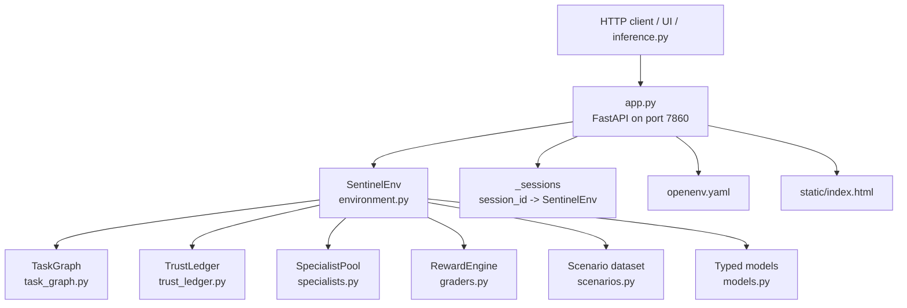
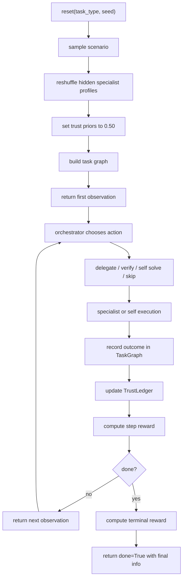
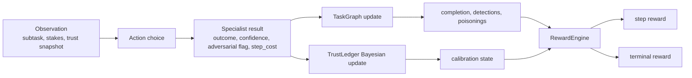
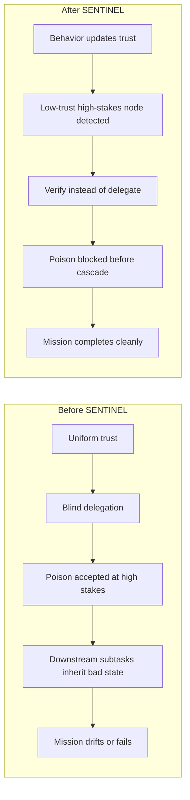
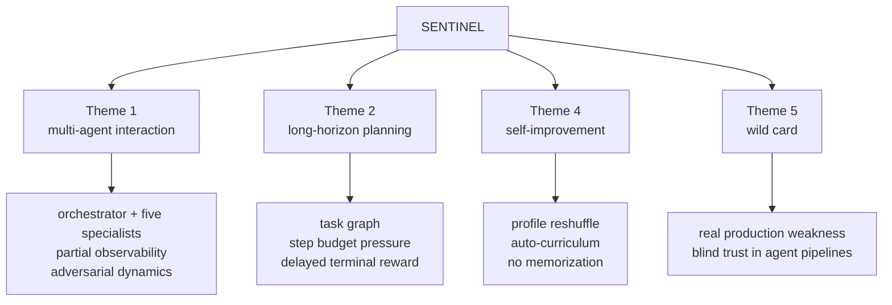
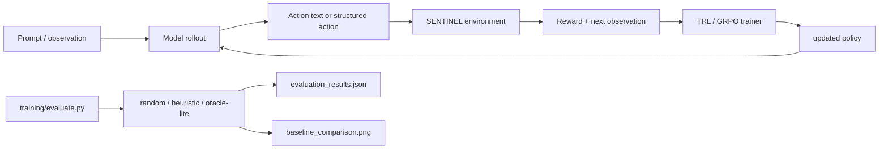

# SENTINEL Visual System

This file is the diagram source of truth. Every diagram used in README, UI, blog, or slides should be derived from here.

## Diagram Inventory

| Diagram | Purpose | Status |
| --- | --- | --- |
| System stack | show the code architecture | ready |
| Episode lifecycle | explain `reset()` to terminal reward | ready |
| Trust and reward flow | show how state turns into learning signal | ready |
| Before / after | show why SENTINEL matters | ready |
| Theme fit | map the project to the hackathon | ready |
| Training loop | show OpenEnv -> TRL / Unsloth pipeline | ready |

---

## 1. System Stack

---

## 2. Episode Lifecycle

---

## 3. Trust And Reward Flow

---

## 4. Before / After

---

## 5. Theme Fit

---

## 6. Training Loop

---

## Use Rules

1. Do not invent new component names in slide decks that do not exist in code.
2. Use `SentinelEnv`, `TrustLedger`, `SpecialistPool`, `TaskGraph`, `RewardEngine` consistently.
3. Use real baseline numbers in public before/after materials.
4. Export polished PNG versions from these mermaid sources later, but keep this file as the editable truth.
